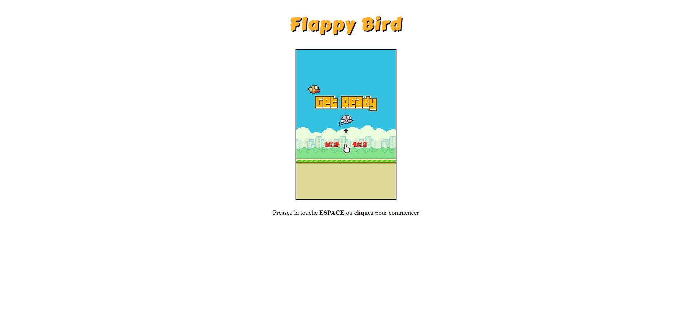

<p align="center">
    
</p>

# Flappy Bird

Ce projet consistait à récréer ma propre version du jeu Flappy Bird grâce à mes connaissances actuelles en développement web. En me servant de l'élément *<canvas>*, j'ai pu dessiner les  éléments du jeu à l'intérieur de celui-ci en plus d'incorporer de la logique à cet ensemble.

# Screenshot 



# Liste de tâches
---
## HTML
 - [X] Conteneur pour l'écran de jeu (ou la grille de jeu)
 - [X] Titre du jeu
 - [X] Ajouter l'élément `<canvas>`

## CSS
 - [X] *Centrer* le titre
 - [X] *Centrer* le canevas 

## JavaScript 
 - [X] Images relatives aux éléments du jeu
 - [X] Jouer un son différent à chaque fois que l'oiseau vole, meurt, se heurte ou qu'il passe un obstacle
 - [X] Fonction pour switcher entre les états de jeu
 - [X] Ensemble de fonctions pour gérer les mouvements de l'oiseau


# ✨ Fonctionnalités principales

- **Gameplay classique:** L'oiseau se déplace constamment vers la droite. Lorsqu'il évite les obstacles et qu'il continue d'avancer le score est incrémenté de 1.
- **Détection de collision:** Le jeu prend fin quand l'oiseau se cogne contre un tuyau, le sol ou qu'il dépasse les limites du canevas.
- **Effets sonores:** Selon l'état de jeu (début, en cours, fin de partie, etc...) un son est joué via JavaScript.
- **Sauvegarde du meilleur score:** Tenir un registre du score ainsi que du meilleur score obtenu par le joueur au cours d'une partie.

# ⛏️ Tech Stack

▪ **HTML:** pour la structure de la page, celle-ci contenant l'élément *<canvas>*, le titre et les instructions pour jouer au jeu.
▪ **CSS:** afin d'appliquer des styles aux éléments du jeu.
▪ **JavaScript:** regroupe les mécaniques de jeu, le système de collision, le relancement de nouvelles parties.

## 🚀 Installation locale

Si tu veux cloner le projet pour contribuer, suis ces étapes :

### 1. Cloner le repo
```bash
git clone https://github.com/Paul04sho/flappy-bird.git
```

### 2. Accéder au dossier
```
cd flappy-bird
```


## 🤝 Contribution

Toute contribution à ce projet est la bienvenue ! 
Voici les étapes à suivre: 

1. Fork le repo
2. Créez une nouvelle branche (git checkout -b feature/nom-de-ta-feature)
3. Commit tes modifications
4. Push la branche (git push origin feature/nom-de-ta-feature)
5. Ouvre une Pull Request depuis Github

## 📜 Licence

Distribué sous licence MIT. Plus d'informations ici : https://choosealicense.com/licenses/mit/


